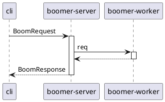

# Introduction

This site shows how to create a Go app that has logs, metrics and traces visible in Grafana.  The Grafana datasources are configured to
ensure a seamless click-through experience between each of these signals.  The implementation of metrics and traces within the app makes use
of [OpenTelemetry-Go](https://pkg.go.dev/go.opentelemetry.io/otel), and logging uses the [log/slog](https://pkg.go.dev/log/slog) package
that was [introduced](https://go.dev/blog/slog) in Go 1.21.

The site is backed by a [fully-working demo](https://github.com/boyvinall/observability-demo), so you can easily run it up and explore how
to navigate around.  This also means you have a complete reference for how to implement things yourself – many other examples online exist
only as small fragments, often requiring you to read a bunch of other docs before you have enough to get that _*!&$@%_ thing working.

The demo consists of:

- Some application components:
    - GRPC server
    - worker service which receives messages from the GRPC server over [NATS](https://nats.io/)
    - command-line app to post requests to the GRPC server
- Various infra services:
    - Grafana – including provisioned datasources and dashboards
    - Loki/Promtail
    - Tempo
    - Prometheus
    - NATS

The request flow between the different application components is super simple:

